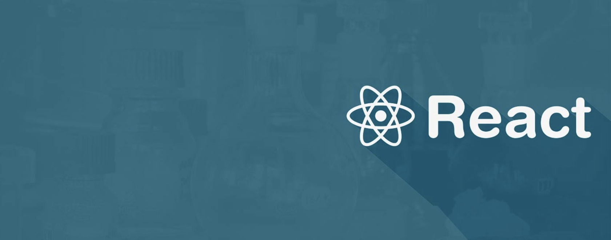

	A curated list of <strong>free resources</strong> to master React Development

## Table Of Contents
- [Motivation](#motivation)
- [Essential Path](#essential-path)
	- [Why React?](#why-react)
	- [React](#react)
	- [ES2015+](#es2015)
	- [Routing](#routing)
	- [State Management](#state-management)
	- [Bundlers](#bundlers)
	- [Build Stuff](#build-stuff)
- [Optional Path](#optional-path)
	- [Typescript](#typescript)
- [How To Use This Guide](#how-to-use-this-guide)
- [How To Collaborate](#how-to-collaborate)
- [Team](#team)
- [Inspiration And Additional Resources](#inspiration-and-additional-resources)

## Motivation
This project aims to collect the **best free resources** for those that want to learn how to build applications with React and also understand the [concepts](https://github.com/reactjs/react-basic) that come with its adoption like Functional Programming, Composition, Unidirectional Data Flow and many others.

## Essential Path
### Why React?
1. [JS Apps at Facebook](https://www.youtube.com/watch?v=GW0rj4sNH2w)
1. [Why did we build React?](https://facebook.github.io/react/blog/2013/06/05/why-react.html)
1. [React: Rethinking best practices](https://www.youtube.com/watch?v=x7cQ3mrcKaY)

### [React](https://facebook.github.io/react/)
1. [React Docs - Quick Start section](https://facebook.github.io/react/docs/installation.html) `basic`
1. [The Road to learn React](https://leanpub.com/the-road-to-learn-react) `basic`

### ES2015+
1. [Learn ES6 (ECMAScript 2015)](https://egghead.io/courses/learn-es6-ecmascript-2015) `basic`
1. [Exploring ES6](http://exploringjs.com/es6/) `advanced`
1. [Exploring ES2016 and ES2017](https://leanpub.com/exploring-es2016-es2017/read) `advanced`

### Routing
1. [React Router Docs](https://react-router.now.sh/) `basic`

### State Management
#### [Redux](http://redux.js.org/)
1. [Getting Started with Redux](https://egghead.io/courses/getting-started-with-redux) `basic`
1. [Building React Applications with Idiomatic Redux](https://egghead.io/courses/building-react-applications-with-idiomatic-redux) `advanced`

### Bundlers
#### [Webpack](https://webpack.js.org/)
1. [Get Started with Webpack](https://webpack.js.org/get-started/)

### Build Stuff
1. [Several project ideas](https://react.rocks/)
1. [React - TodoMVC](http://todomvc.com/examples/react/#/)
1. [Bootstrapping a React project](https://auth0.com/blog/bootstrapping-a-react-project/)
1. [Build a Weather app](http://academy.plot.ly/react/1-introduction/)
1. [The SoundCloud Client in React + Redux](http://www.robinwieruch.de/the-soundcloud-client-in-react-redux/)
1. A Primer on the React Ecosystem: [1](http://patternhatch.com/2016/07/06/a-primer-on-the-react-ecosystem-part-1-of-3/), [2](http://patternhatch.com/2016/08/02/a-primer-on-the-react-ecosystem-part-2-of-3/) and 3.
1. [Building a React/Redux App with JSON Web Token (JWT) Authentication](http://blog.slatepeak.com/build-a-react-redux-app-with-json-web-token-jwt-authentication/)

## Optional Path
### Static Type Checkers
#### [Flow](https://flowtype.org/)

#### [Typescript](https://www.typescriptlang.org/)
1. [Gitbook Typescript deep dive](https://www.gitbook.com/book/basarat/typescript/details)
1. [React - Redux - Typescript - TodoMVC](https://github.com/jaysoo/todomvc-redux-react-typescript)
1. [React Typescript samples](https://github.com/Lemoncode/react-typescript-samples)

### Immutable Data Structures
#### [Immutable.js](https://facebook.github.io/immutable-js/)
1. [Immutable.js: An Introduction with examples written for humans](http://untangled.io/immutable-js-an-introduction-with-examples-written-for-humans/)

## How To Use This Guide
Use a **linear approach** to complete this guide. That means you should start with the first resource in the **[Essential Path](#essential-path)** and pass to the next one after you finish the previous and after make a practical project to internalize what you have learned.

The React's ecosystem is overwhelming for beginners. Ensure to learn each new tool **isolatedly**.

In the sections about React, Webpack, and ES2015+, the initial resources are more superficial and the last ones are going deeper in the respective topic. You can opt to learn the basics first and return to them later, but don't skip them without have a basic knowledge of the matter.

After you complete the *Essential Path*, you can choose one (or more) topics in the **[Optional Path](#optional-path)**. You do not need to go through this section in the same linear approach, you should choose new topics to learn based on your necessity and/or desire.

## How To Collaborate
To suggest new sections or new resources, open **one issue** for each resource/section explaining why we should add/remove such item. After at least 5 people approve (:+1:) your indication, you will be invited to create the pull request.

The reason to keep this way of collaboration is to ensure that our list of resources will be really concise, bringing only the best resources for those that want to master the topics listed here.

**Inspiration**

1. [You’re Missing the Point of React](https://medium.com/@dan_abramov/youre-missing-the-point-of-react-a20e34a51e1a#.qgt6xupid) 
1. [react-makes-you-sad](https://github.com/gaearon/react-makes-you-sad)
1. [react-howto](https://github.com/petehunt/react-howto)
1. [Your Timeline for Learning React](https://daveceddia.com/timeline-for-learning-react/)
1. [5 Steps for Learning React Application Development](http://developer.telerik.com/featured/5-steps-for-learning-react-application-development/)
1. [Path to Learning React](https://www.reddit.com/r/reactjs/comments/4r95aj/path_to_learning_react/)

**Additional Resources**

1. [React/Redux Links](https://github.com/markerikson/react-redux-links)
1. [Redux Ecosystem Links](https://github.com/markerikson/redux-ecosystem-links)
1. [Community Resources](https://github.com/markerikson/react-redux-links/blob/master/community-resources.md)
